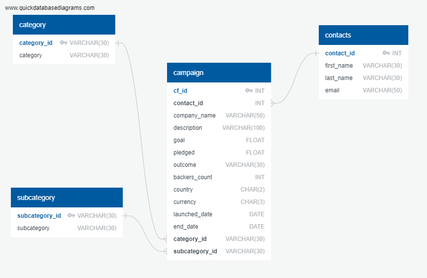

# Crowdfunding ETL Project

## Overview
This project is an ETL (Extract, Transform, Load) pipeline for a crowdfunding dataset. The purpose of the project is to extract data from various sources, transform it into a usable format, and load it into a database for analysis.

### Purpose

The project provides a robust framework for managing crowdfunding data, which includes contacts, campaigns, and categorical information. With this ETL pipeline, users can automate the data handling process, ensuring data integrity and consistency.

### Scope

This pipeline caters to the needs of data analysts who require a reliable and efficient way to prepare crowdfunding data for in-depth analysis. It supports various data operations, such as data cleansing, transformation, and preparation for querying and reporting.

Then the produced CSV files are used as a source data for PostgreSQL database.

### Objectives

- To facilitate easy and efficient extraction of data from provided .xlsx and .csv files.
- To transform the data through cleaning and normalization, making it suitable for analytical purposes.
- To load the processed data into a structured SQL database, enabling complex queries and data exploration.

By the end of the ETL process, users will have a well-organized database, ready for analysis and insight generation, to aid in the decision-making process of crowdfunding initiatives.

Also this project can be considered as a data migration solution from old technology (Excel) to the new one (PostgreSQL).

## Setup and Installation

To get the Crowdfunding ETL pipeline up and running on your local machine, follow these steps:

### Prerequisites

Before you begin, ensure you have the following installed:
- Python 3.8 or higher, which can be downloaded from the official [Python website](https://www.python.org/downloads/).
- Jupyter Notebooks or JupyterLab, which can be installed via pip with `pip install notebook` or `pip install jupyterlab`.
- PostgreSQL: Make sure you have PostgreSQL installed on your system. You can download it from the official [PostgreSQL website](https://www.postgresql.org/download/). Alternatively, you can use a service like Heroku Postgres if you prefer a cloud-based solution.

### Clone the Repository

Start by cloning the repository to your local machine:

```bash
git clone https://github.com/NataliiaShevchenko620/Crowdfunding_ETL.git
cd Crowdfunding_ETL
```
## Project Structure

The Crowdfunding ETL project is organized into several key directories and files. Here's an overview of the project's structure:

- `crowdfunding_db_schema.sql`: Contains the SQL statements for creating the database schema necessary for storing the processed data.

- `ETL_Mini_Project_NShevchenko_HKKang_TBrown.ipynb`: This Jupyter Notebook contains the logic for the ETL process, including data extraction, transformation, and loading.

- `schema.png`: A visual representation of the database schema.

- `schema.txt`: A textual representation of the database schema. It should be used on https://app.quickdatabasediagrams.com/.

- `queries.sql`: A set of SQL queries to check data in the PostgreSQL database.

- `/Resources`: A directory containing both source and produced data, including `contacts.xlsx` and `crowdfunding.xlsx`, these Excel files serve as the data sources from which the ETL process extracts information. The CSV files are results of the ETL work.

- `/Screenshots`: A directory containing screenshots of SELECT queries to PostgreSQL tables to prove that daat was loaded to the database successfully

```
/Crowdfunding_ETL
|-- /Resources
| |-- campaign.csv
| |-- category.csv
| |-- contacts.csv
| |-- contacts.xlsx
| |-- crowdfunding.xlsx
| |-- subcategory.csv
|-- /Screenshots
| |-- PostgreSQL_campaign.png
| |-- PostgreSQL_category.png
| |-- PostgreSQL_contacts.png
| |-- PostgreSQL_subcategory.png
|-- crowdfunding_db_schema.sql
|-- ETL_Mini_Project_NShevchenko_HKKang_TBrown.ipynb
|-- README.md (this file)
|-- schema.png
|-- schema.txt
```

## Database Schema

The database schema for the Crowdfunding ETL project is designed to efficiently organize and store data extracted from various crowdfunding platforms. The schema consists of the following tables:

### Tables

- `category`: Stores information about the different categories of crowdfunding campaigns.
  - `category_id` (VARCHAR(30), Primary Key): Unique identifier for each category.
  - `category` (VARCHAR(30)): Name of the category.

- `subcategory`: Stores details about the subcategories under each main category of crowdfunding campaigns.
  - `subcategory_id` (VARCHAR(30), Primary Key): Unique identifier for each subcategory.
  - `subcategory` (VARCHAR(30)): Name of the subcategory.

- `contacts`: Keeps the contact information of campaign creators.
  - `contact_id` (INT, Primary Key): Unique identifier for each contact.
  - `first_name` (VARCHAR(30)): First name of the contact.
  - `last_name` (VARCHAR(30)): Last name of the contact.
  - `email` (VARCHAR(50)): Email address of the contact.

- `campaign`: Contains all the details regarding individual crowdfunding campaigns.
  - `cf_id` (INT, Primary Key): Unique identifier for each campaign.
  - `contact_id` (INT, Foreign Key): Reference to the `contacts` table.
  - `company_name` (VARCHAR(50)): Name of the company running the campaign.
  - ... (Other fields as per the schema description)

### Relationships

)

The `campaign` table is at the core of our schema, linked to both `contacts` and `category` tables to provide a comprehensive view of each crowdfunding campaign.

- A campaign belongs to a single category and subcategory.
- Each campaign is created by a contact, with contact details stored in the `contacts` table.

For a complete detailed view of the schema, please refer to the `crowdfunding_db_schema.sql` file which includes all the SQL commands required to create the database and its tables.

By following the database schema, the ETL process populates these tables with data transformed from raw datasets, enabling sophisticated querying and analysis.

## Usage

Once you have the repository cloned, prerequisites installed, and the PostgreSQL database set up, follow these steps to run the ETL pipeline:

1. **Transform data:** run `ETL_Mini_Project_NShevchenko_HKKang_TBrown.ipynb` notebook to produce CSV files

2. **Create the Database and Tables:**

    Create a new database with name `crowdfunding_db` on your PosgreSQL server.

    Run the SQL statements from `crowdfunding_db_schema.sql` to set up the database schema in PostgreSQL. You can do this via the psql command line tool or through a GUI like pgAdmin.

    ```bash
    psql -U username -d crowdfunding_db -a -f crowdfunding_db_schema.sql
    ```
   
   Replace `username` with your PostgreSQL username.

3. **Upload data to the Database:**

   Open pgAdmin tool, connect to the server and the database, locate a list of tables and call *Import/Export Data...* wizard for each of the tables in the following sequence:

   - category
   - subcategory
   - contacts
   - campaign

   Check the result of import by running queries from `queries.sql`.

## License

This project is licensed under the MIT License.

### MIT License Summary

The MIT License is a permissive license that is short and to the point. It lets people do anything they want with your code as long as they provide attribution back to you and don’t hold you liable.

#### Permissions

- Commercial use
- Modification
- Distribution
- Private use

#### Conditions

- Include copyright and license notice

#### Limitations

- No Liability
- No Warranty


